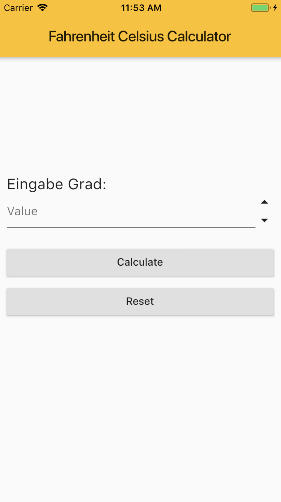

# Fahrenheit Celcius Calculator

## Eine einfache Flutter-App

Ein Rechner zum Umrechnen von Fahrenheit in Celcius und umgekehrt.

Ein beliebiger Wert (Fahrenheit oder Celsius) wird nach der Eingabe bidirektional
in Fahrenheit und Celsius umgerechnet.

Falsche Eingaben werden abgewiesen.

Die Oberfläche der App sieht so aus:

## Klasse ``StatefulWidget``

Die Implementierung des App hat das Ziel, die Arbeitsweise der Klasse ``StatefulWidget`` zu verdeutlichen. Studieren Sie am vorliegenden Quellcode die beiden Klassen ``FahrenheitCelciusCalculator`` (Spezialisierung der Klasse ``StatefulWidget``) und ``_FahrenheitCelciusCalculator``  (Spezialisierung der Klasse ``State<FahrenheitCelciusCalculator>``). Die zu überschreibenden Methoden ``createState`` bzw. ``build`` und der Aufruf der ``setState``-Methode stellen den Kern der Implementierung dar.

