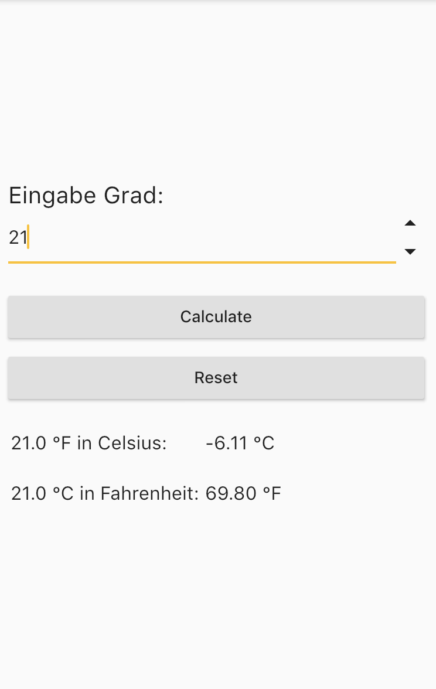

# Fahrenheit Celsius Calculator

## Eine einfache Flutter-App

Ein Rechner zum Umrechnen von Fahrenheit in Celsius und umgekehrt.

Ein beliebiger Wert (Fahrenheit oder Celsius) wird nach der Eingabe bidirektional
in Fahrenheit und Celsius umgerechnet.

Falsche Eingaben werden abgewiesen.

Die Oberfläche der App sieht im Ursprungszustand so aus:

Abbildung 1: Oberfläche der Fahrenheit-Celsius Calculator-App.

## Klasse ``StatefulWidget``

Die Implementierung des App hat das Ziel, die Arbeitsweise der Klasse ``StatefulWidget`` zu verdeutlichen. Studieren Sie am vorliegenden Quellcode die beiden Klassen ``FahrenheitCelsiusCalculator`` (Spezialisierung der Klasse ``StatefulWidget``) und ``_FahrenheitCelsiusCalculator``  (Spezialisierung der Klasse ``State<FahrenheitCelsiusCalculator>``). Die zu überschreibenden Methoden ``createState`` bzw. ``build`` und der Aufruf der ``setState``-Methode stellen den Kern der Implementierung dar.

Nach Eingabe eines Wertes (nur ganze Zahlen) sieht die Oberfläche der App so aus:

Abbildung 2: Darstellung der Umrechnungsergebnisse.